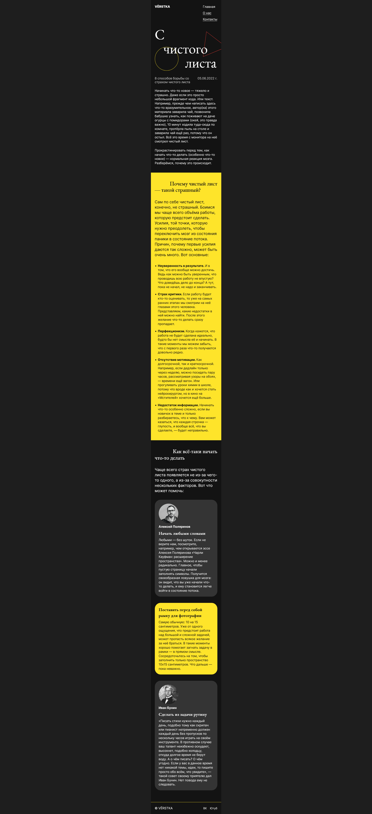

# Яндекс Практикум, вёрстка странички "С чистого листа" v2

## Оглавление

- [Скриншот](#скриншот)
- [Ссылки](#ссылки)
- [Автор](#автор)
- [Благодарность](#благодарность)

### Скриншот

### Ссылки

- URL решения: [Github](https://github.com/MikeBeloborodov/s_chistogo_lista_page)
- URL лайв сервера: [Netlify](https://hilarious-cat-b2586e.netlify.app/)

## Автор

- Github - [Mike Beloborodov](https://github.com/MikeBeloborodov)
- Frontend Mentor - [@MikeBeloborodov](https://www.frontendmentor.io/profile/MikeBeloborodov)

## Благодарность

Благодарю команду Яндекс Практикум за предоставление дизайна и уроков!